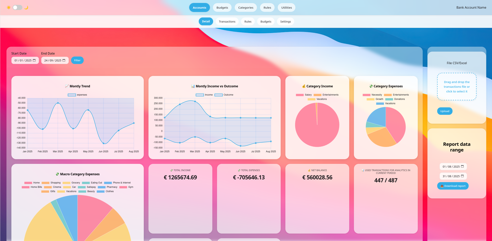

# Expense Manager



Expense Manager is a comprehensive personal finance and business expense tracking application. It allows users to efficiently manage accounts, categorize transactions, apply custom rules, import/export data, and generate detailed analytical reports.

---

## Features

### 1. Accounts & Transactions
- Manage multiple accounts with real-time balances.
- Add, edit, and delete transactions.
- Track expenses and income across different accounts.

### 2. Transaction Categorization
- Assign transactions to custom categories.
- Organize spending patterns by category.
- Apply rules to automatically categorize transactions.

### 3. Rules Engine
- Define rules to automatically classify transactions based on description, amount, or other parameters.
- Apply rules in bulk to existing transactions.
- Customize priority of rules for accurate categorization.

### 4. Analytics & Reports
- Generate visual analytics for spending trends.
- Create detailed reports for transactions that are partially or fully excluded from analytical calculations.
- Export reports in CSV format for further analysis.

### 5. Import & Export
- Import transactions from Excel or CSV files.
- Backup and restore your database with ease.
- Export categorized transactions for reporting or accounting purposes.

### 6. Backup & Restore
- One-click backup of your entire dataset.
- Restore from previous backups to prevent data loss.

---

## Installation

1. Clone the repository:

```bash
git clone https://github.com/yourusername/expense-manager.git
cd expense-manager
```

2. Build the application (requires Rust)
```bash
cargo build --release
```

3. Run the application
```bash
cargo run --release
```

## Docker setup
1. Launch `make-docker-build.sh` inside `scripts` directory.

2. Use `scripts/linux/start.desktop` to start the dockerized application and `scripts/linux/stop.desktop` to stop it.
